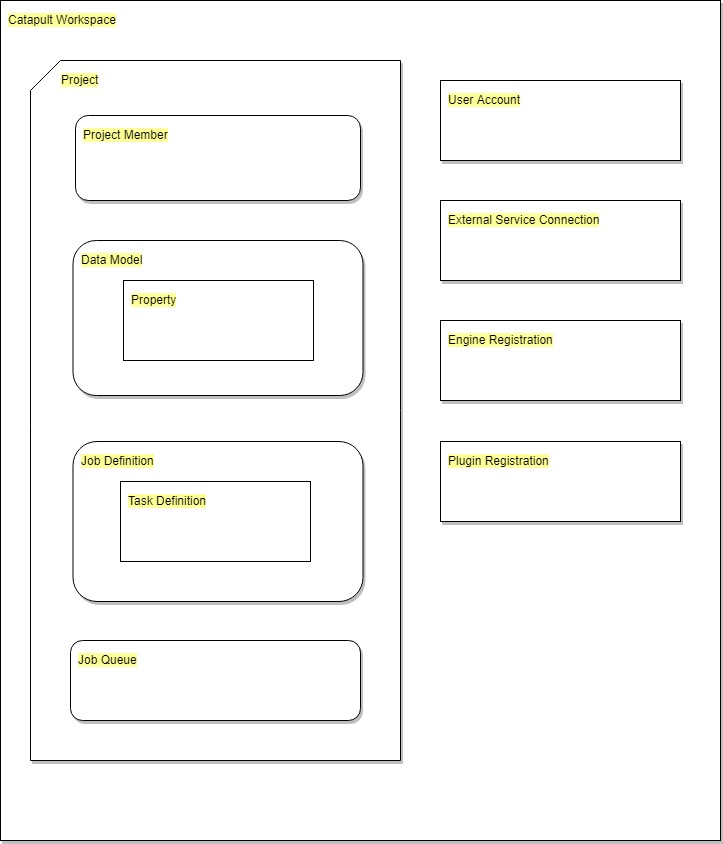

# Concept

This section will guide you to understand the concept of some key elements in `OpenCatapult` system.

After setting up a new `OpenCatapult` instance, you will get a blank workspace. You can start to fill it with:

- User Account
- Project
- External Service Connection
- Engine Registration
- Plugin Registration

## User Account

Administrators can add as many as users they want. Each user can be assigned to a different role which will affect on her ability to access `OpenCatapult` elements.

[See more details](../user-guides/users.md)

## Project

Project is a unit of work which your team will usually work with to create an application.

In this Project scope, you can define:

- Project Member
- Data Model
- Job Definition
- Job Queue

### Project Member

Project member is a user who is given access to a project with specific role. Project member should be an active user.

[See more details](../user-guides/project-members.md)

### Data Model

Data Model is a logical structured entity which is used by code generators for various purposes. It is usually used to generate tables in database, controllers, pages, etc.

Data Model consists of many **Properties**, which usually can be translated into columns in database world.

[See more details](../user-guides/data-models.md)

### Job Definition

Job Definition is a unit of work which is used to define specific action. It may consist of many **Task** definitions.

For example, you can define a job which sequentially will execute the following tasks: generate code, push it to a code repository, and deploy it to a hosting service.

[See more details](../user-guides/job-definitions.md)

### Job Queue

After defining Job, you can put it in Queue so the [Engine](../engine/engine.md) can pick and execute it.

[See more details](../user-guides/job-queues.md)

## External Service Connection

When defining a Job, it is often that you need to include some information which is required to connect to external services, e.g. GitHub, Azure, etc. Instead of filling them directly in Task definition, it is recommended that you fill them via External Service Connection. It will give you some advantages:

- you don't need to enter the same information over and over again in different Tasks
- it can be reused accross projects
- it is more secure because the values are encrypted

[See more details](../user-guides/external-services.md)

## Engine Registration

Engine is a component in `OpenCatapult` which will execute queued jobs. For scaling purpose you can have multiple Engine instances in a `OpenCatapult` system. However you need to register them in advance to give them permission to access certain elements.

[See more details](../user-guides/engine-registration.md)

## Plugin Registration

Plugin is the extension of Engine which implement specific action. Plugin needs to be registered as well to:

- allow Plugin to ask for specific configuration input from user
- allow syncronization of the installed Plugins across Engine instances

[See more details](../user-guides/plugins.md)